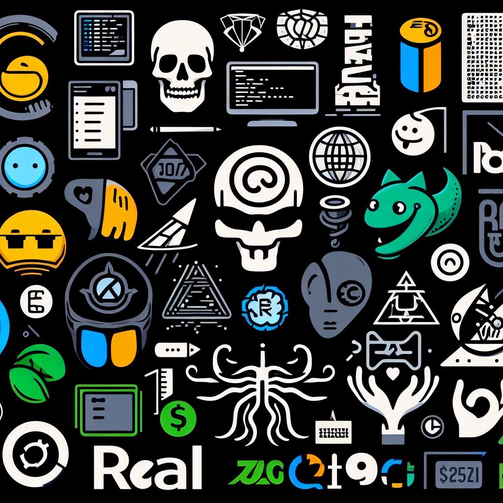

    
    
       

  

# Hola, soy Diego Rubi 👋

Soy un apasionado desarrollador de aplicaciones con un enfoque en la creación de soluciones innovadoras y experiencias de usuario excepcionales. Mi viaje en el mundo del desarrollo comenzó con mi curiosidad por la tecnología y mi deseo de crear aplicaciones que resuelvan problemas reales.

## ¿Qué hago?

- **Desarrollo de Aplicaciones:** Creo aplicaciones móviles y web que mejoran la vida de las personas y hacen que las tareas diarias sean más fáciles y eficientes.
- **Tecnologías:** Me especializo en **Kotlin, Java, Node.js** y siempre estoy aprendiendo y experimentando con nuevas herramientas y marcos de trabajo.
- **Código Abierto:** Me enorgullece ser un colaborador activo en proyectos de código abierto y contribuir a la comunidad de desarrolladores.

## 🌟 Proyectos Destacados

### Proyecto 1: [Tin Marin](https://github.com/Tin-Marin)
Proyecto para aprender mas sobre el museo tin marin de forma dinamica y entretenida.

### Proyecto 2: [Lessa](https://github.com/DEV-ART-RAT/LESSA)
Aprende lenguaje de señas Salvadoreño con Lessa.

## 📂 Portafolio

  

## 📫 Conversemos

Estoy siempre abierto a nuevas oportunidades y colaboraciones emocionantes. Puedes contactarme a través de [LinkedIn](tu perfil de LinkedIn) o por [email](tu email).

¡Gracias por visitar mi perfil de GitHub!
