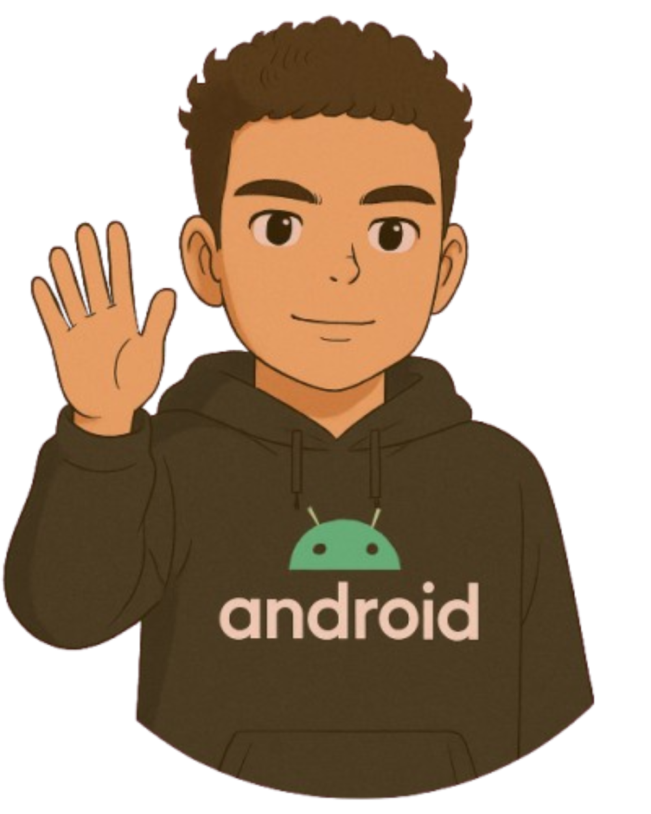
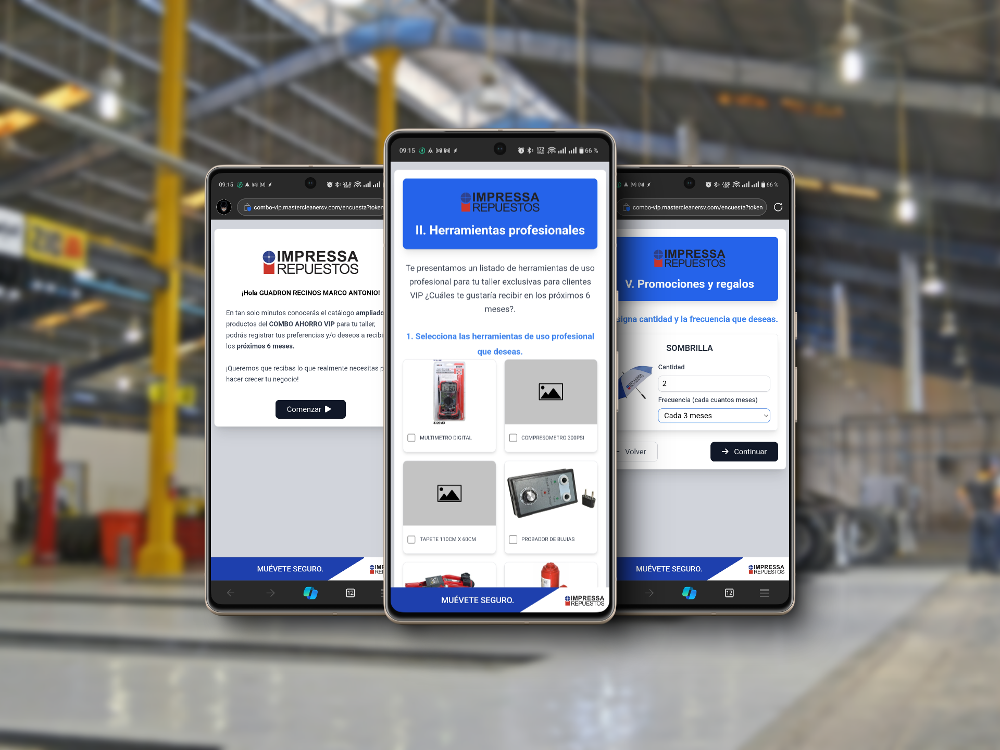
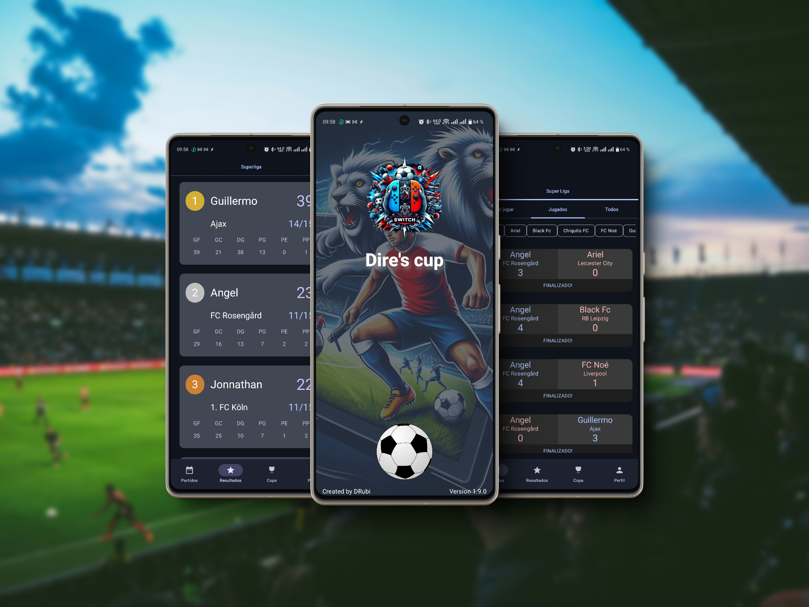
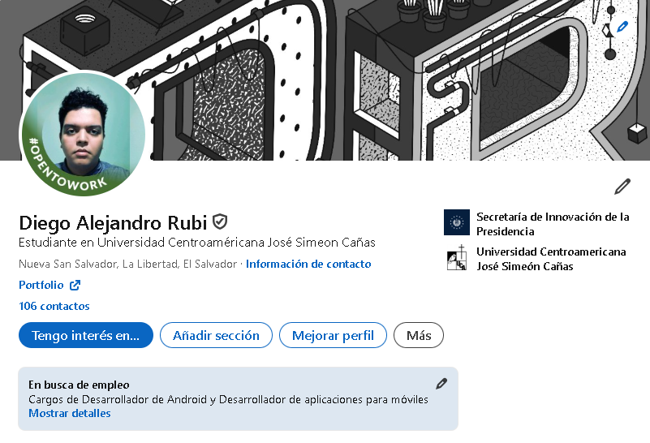
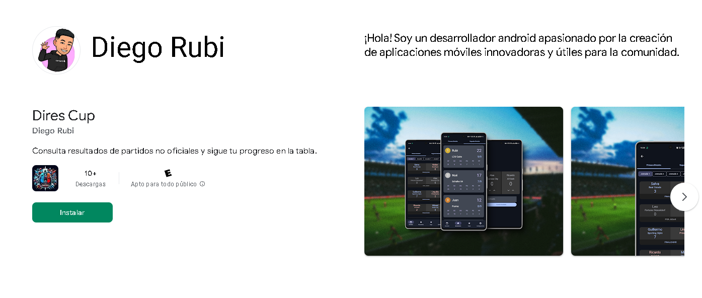

    
    

        <h1 style="margin: 0;">Diego Rubi - Mobile Developer</h1>
        

            Soy un desarrollador móvil de El Salvador con experiencia en Kotlin y Flutter, 
            trabajando en el desarrollo de aplicaciones y soluciones digitales. Me especializo 
            en crear aplicaciones funcionales, atractivas y fáciles de usar.
        

    

---

## 💼 ¿Qué hago?

- **Aplicaciones móviles**  
  Desarrollo profesional de aplicaciones Android con Kotlin y Flutter, aprendiendo Swift.
- **Desarrollo web**  
  Aprendiendo tecnologías web para complementar mis habilidades.

---

## 🛠️ Habilidades

| Habilidad               | Nivel |
|-------------------------|-------|
| Android (Kotlin/Java)   | 80%   |
| Flutter Developer       | 60%   |
| Backend con Node.js     | 60%   |
| WordPress               | 50%   |

---

## 📂 Portafolio

### 🖥️ Proyectos destacados

1. **Aplicaciones móviles**  
   - Aplicación para [Secretaría de Innovación](#)  
     Desarrollada con Kotlin y Jetpack Compose.
   - Aplicación para [Ministerio de Salud](#)  
     Mantención y mejora de apps nativas con Kotlin.

2. **Proyectos web**  
   - Página web dinámica en WordPress para [The Virtual Buddy](#).

---
# Portafolio

## Sobre mí  
Soy un desarrollador especializado en Android y amante de las buenas prácticas de programación como **Clean Architecture** y los principios **SOLID**. También tengo experiencia en Kotlin y Flutter,.

---

## Proyectos  
### 1. **Combo Vip**  
Aplicación para seleccionar premios con los puntos que se han acumulado por ser cliente frecuente.  

### 2. **Dires Cup**  
Una app para visualizar resultados de partidos FIFA no oficiales entre amigos, con tablas de posiciones y soporte para múltiples divisiones.  

---

## Redes Sociales  
- [**LinkedIn**](https://www.linkedin.com/in/drubico)  
  Conéctate conmigo para explorar mi experiencia profesional y proyectos.  
  

---

## Descarga mis Aplicaciones  
- [**Google Play Store**](https://play.google.com/store/apps/dev?id=5906834204268116327)  
  Descarga y explora mis aplicaciones en la tienda oficial de Android.  
  

---

## 📞 Contacto

- **Email:** [drubico@gmail.com](mailto:drubico@gmail.com)  
- **Ubicación:** San Salvador, El Salvador  

[Visita mi portafolio aquí](https://drubico.github.io/portfolio/)
