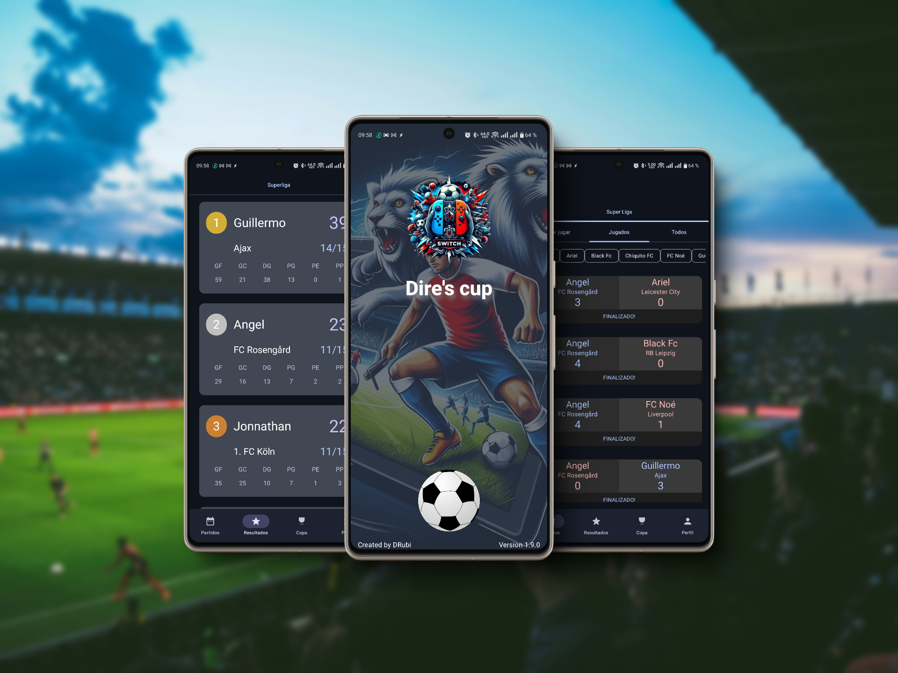
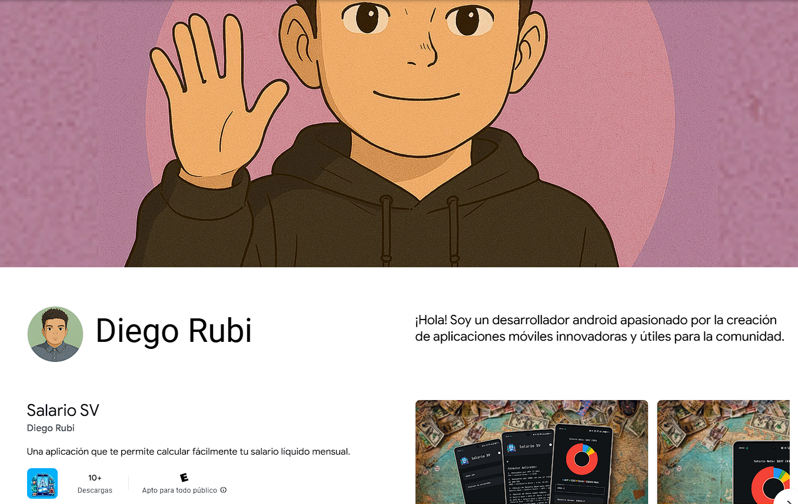

  

<h1 align="center">¡Hola! Soy Diego Rubí </h1>

  

  
  
  
  

  
  
  

---

### 👨‍💻 Sobre Mí

Soy <b>Ingeniero en Informática</b> y <b>Desarrollador Móvil Senior</b> con más de <b>4 años de trayectoria</b> diseñando y construyendo aplicaciones móviles nativas de alto rendimiento. Mi especialidad es el ecosistema <b>Android nativo con Kotlin y Jetpack Compose</b>, implementando <b>Clean Architecture</b>, <b>MVVM</b> y patrones reactivos modernos.

He liderado e implementado soluciones de software de impacto crítico a nivel nacional para el <b>Ministerio de Salud (MINSAL)</b> y la <b>Secretaría de Innovación de la Presidencia de El Salvador</b> —logrando reducir la latencia operativa en un <b>40%</b>—, así como herramientas móviles corporativas en <b>PBS GROUP</b> y aplicaciones comerciales publicadas en <b>Google Play Store</b>.

---

### ⚡ Highlights & Métricas Clave

| 📱 Google Play | 💼 Experiencia | ⚡ Rendimiento | 🏛️ Sector Público & Privado |
| :---: | :---: | :---: | :---: |
| **Apps en Producción** Salario SV en Play Store ⭐ | **+4 Años** Especialista Android Nativo | **-40% Latencia** Optimización en apps críticas | **Presidencia, MINSAL & PBS** Soluciones a escala nacional |

---

### 📊 Actividad & Estadísticas en GitHub

  
  

 

  

---

### 🛠️ Stack Tecnológico & Habilidades

  

#### 📱 Desarrollo Móvil (Core)
`Kotlin` • `Jetpack Compose` • `Android SDK (Nativo)` • `Java` • `Flutter` • `Dart` • `Coroutines` • `Flow & StateFlow` • `XML Layouts`

#### 🏗️ Arquitectura & Patrones de Software
`Clean Architecture` • `MVVM` • `MVI` • `Dagger Hilt` • `Koin` • `Inyección de Dependencias` • `Modularización` • `Clean Code`

#### 💾 Datos, Persistencia & Red
`Room DB` • `SQLite` • `DataStore` • `Retrofit` • `OkHttp` • `RESTful APIs` • `Firebase (Auth, Firestore, Cloud Messaging)`

#### 📋 Soluciones de Campo & Enterprise
`ODK Collect` • `Enketo` • `ODK Central` • `Procesamiento y parseo XML avanzado` • `Captura de datos offline`

#### 🌐 Backend & Web
`Node.js` • `Express` • `C#` • `Blazor` • `TailwindCSS` • `HTML5 / CSS3` • `JavaScript`

#### 🔧 Herramientas, Testing & DevOps
`Android Studio` • `Git` • `GitHub Actions (CI/CD)` • `Gradle (KTS)` • `Postman` • `Figma` • `JUnit` • `Mockk`

---

### 🚀 Proyectos Destacados

<table>
  <tr>
    <td width="50%" valign="top">
      <h3 align="center">📱 Salario SV</h3>
      

        
      

      

        
      

      
<b>Calculadora fiscal y salarial avanzada para El Salvador.</b> Permite calcular con precisión matemática el salario neto tras deducciones legales (AFP, ISSS, ISR) y proyectar escenarios financieros personales.

      <ul>
        <li>✨ Interfaz fluida y moderna 100% en <b>Jetpack Compose</b>.</li>
        <li>✨ Lógica de negocio encapsulada con <b>Clean Architecture</b> y <b>Koin</b>.</li>
        <li>✨ Soporte offline y sincronización mediante <b>Firebase</b>.</li>
      </ul>
      

        
        
        
        
      

    </td>
    <td width="50%" valign="top">
      <h3 align="center">💳 FinFlex</h3>
      

        
      

      

        
      

      
<b>Plataforma integral de gestión inteligente de finanzas personales.</b> Control automatizado de tarjetas de crédito, visualización gráfica de balances y alertas de fechas de corte y pago.

      <ul>
        <li>✨ Gráficos interactivos de distribución de gastos en Compose.</li>
        <li>✨ Sistema preventivo de notificaciones y cortes de tarjetas.</li>
        <li>✨ Inyección de dependencias robusta con <b>Dagger Hilt</b>.</li>
      </ul>
      

        
        
        
        
      

    </td>
  </tr>
  <tr>
    <td width="50%" valign="top">
      <h3 align="center">⚽ Dires Cup</h3>
      

        
      

      

        
      

      
<b>Plataforma de seguimiento y administración de torneos deportivos amateur.</b> Tablas de clasificación en vivo, fixtures de partidos y estadísticas individuales de jugadores.

      <ul>
        <li>✨ Marcadores y estadísticas sincronizadas en tiempo real.</li>
        <li>✨ Gestión integral de jornadas, goles y tablas de posiciones.</li>
        <li>✨ Arquitectura reactiva con StateFlow y Room.</li>
      </ul>
      

        
        
        
        
      

    </td>
    <td width="50%" valign="top">
      <h3 align="center">🎁 Combo Vip</h3>
      

        
      

      

        
      

      
<b>Sistema web corporativo para fidelización de clientes VIP.</b> Gestión integral de retroalimentación, métricas de satisfacción y catálogo de recompensas por puntos acumulados.

      <ul>
        <li>✨ Panel interactivo desarrollado con componentes <b>Blazor</b>.</li>
        <li>✨ UI responsiva y moderna construida con <b>TailwindCSS</b>.</li>
        <li>✨ Backend sólido y tipado en C# .NET.</li>
      </ul>
      

        
        
        
        
      

    </td>
  </tr>
</table>

---

### 📱 Catálogo de Desarrollador en Google Play Store

  

  

---

### 💼 Trayectoria Profesional

<b>🏢 Desarrollador Móvil Senior — PBS GROUP</b> <i>(Marzo 2025 — Presente)</i>

 

- 📱 Arquitectura y desarrollo de soluciones móviles empresariales con **ODK Collect** y **Enketo**.
- ⚙️ Consumo y renderizado dinámico de formularios desde **ODK Central** aplicando **Clean Architecture** y principios **SOLID**.
- 🔄 Creación de flujos de captura de datos de alta precisión para operación en campo y sincronización resiliente.
- 🔗 Integración de APIs REST con manejo y validación avanzada de esquemas XML en Android.

<b>🏛️ Desarrollador Móvil Senior — Secretaría de Innovación de la Presidencia</b> <i>(Octubre 2022 — Marzo 2025)</i>

 

- 🚀 Liderazgo técnico en el diseño y desarrollo de aplicaciones móviles nativas para el gobierno de El Salvador con **Kotlin** y **Jetpack Compose**.
- 🏛️ Implementación de arquitectura modular **MVVM** y **Clean Architecture** en plataformas críticas de alcance nacional.
- ⚡ Integración de servicios RESTful mediante **Retrofit** y persistencia offline-first con **Room Database**.
- 👥 Mentoría técnica y coordinación ágil (Scrum) garantizando entregas de features prioritarios con altos estándares de calidad.

<b>🏥 Desarrollador Full Stack — Ministerio de Salud de El Salvador</b> <i>(Febrero 2022 — Octubre 2022)</i>

 

- ⚡ **Optimización del 40% en latencia** de respuesta en sistemas hospitalarios y epidemiológicos críticos.
- 🔄 Modernización de código legacy mediante migración estratégica de **Java a Kotlin**.
- 🌐 Desarrollo de APIs escalables y seguras con **Node.js** y **Express**.
- 💉 Implementación de inyección de dependencias con **Dagger Hilt** para facilitar testing unitario y desacoplamiento.

<b>💻 Desarrollador WordPress & Web — The Virtual Buddy</b> <i>(Enero 2021 — Junio 2021)</i>

 

- 🛠️ Creación e implementación de soluciones CMS a medida sobre WordPress.
- 🎨 Diseño de temas responsivos y optimización de velocidad de carga y posicionamiento SEO.
- 🛒 Integración de pasarelas de pago y flujos de comercio electrónico.

---

### 🎓 Formación Académica & Idiomas

<table width="100%">
  <tr>
    <td width="60%" valign="top">
      <h4>🎓 Universidad Centroamericana José Simeón Cañas (UCA)</h4>
      
<b>Carrera en Ingeniería Informática</b> <i>(2017 — Presente)</i>

      
Formación especializada en arquitectura de software, seguridad de la información, bases de datos y desarrollo de sistemas distribuidos.

    </td>
    <td width="40%" valign="top">
      <h4>🗣️ Idiomas</h4>
      

        
          
        
      

    </td>
  </tr>
</table>

---

### 📫 ¿Hablamos o Colaboramos?

  ¿Tienes un proyecto móvil en mente, una posición abierta o una idea para transformar? <b>¡Conectemos!</b>

  
  &nbsp;
  
  &nbsp;
  

  ⭐ Diseñado y construido con dedicación para el perfil de <b>Diego Rubí</b>

