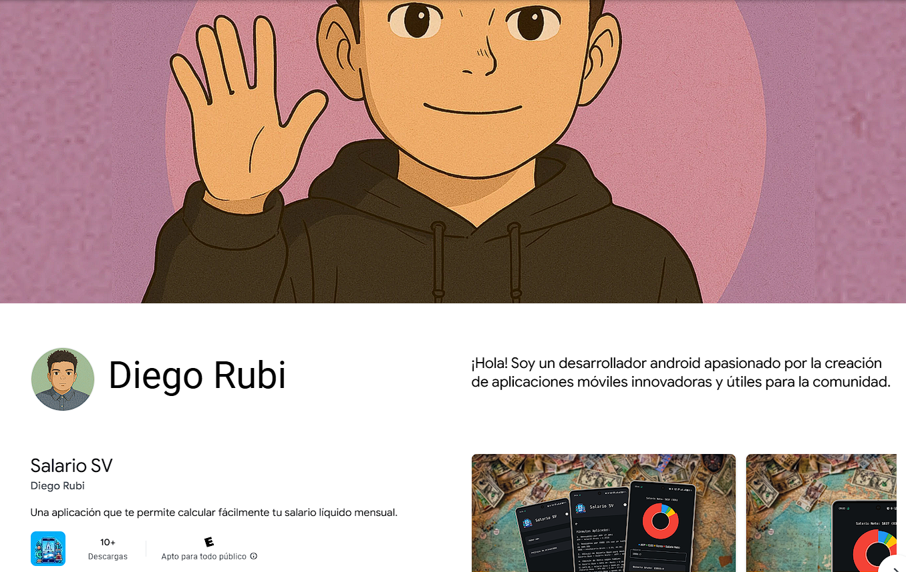

  

<h1 align="center">¡Hola, soy Diego Rubí! </h1>

  <b>Desarrollador Mobile & Web | Apasionado por la tecnología y la innovación</b>

  
  
  

---

  <i>¡Bienvenido a mi perfil de GitHub! Aquí comparto mis proyectos, ideas y soluciones tecnológicas. 
  💼 Conoce más sobre mi experiencia profesional en mi <a href="https://diego-rubi.is-a.dev" target="_blank">portfolio personal</a> (🇪🇸 🇺🇸)
  </i>

---

  

  

  

  

---

## 💼 Mi Portfolio Personal

  

  
  
  

**¿Qué encontrarás en mi portfolio?**
- 📖 Mi historia completa como desarrollador
- 🎯 Casos de estudio detallados de mis proyectos
- 🛠️ Proceso de desarrollo y decisiones técnicas
- 📸 Screenshots y ejemplos de mis aplicaciones
- 🎨 Mi filosofía de diseño y desarrollo
- 📞 Información de contacto directo

---

## 🏆 Logros Destacados

  
  
  

- 🏆 **+4 aplicaciones** publicadas en Google Play Store con calificaciones superiores a 4.0 ⭐
- 📱 **Especialista en Kotlin** con más de 4 años de experiencia en desarrollo Android
- 🚀 **Optimizaciones críticas** que redujeron latencia en un 40% en aplicaciones gubernamentales
- 👥 **Liderazgo técnico** en equipos ágiles para entrega de features prioritarios
- 🏛️ **Experiencia gubernamental** desarrollando para Presidencia y Ministerio de Salud

---

## �️ Idiomas

  
  

---

## �🚀 Servicios

- **Desarrollo Móvil:** Creación de aplicaciones Android nativas con Kotlin, implementando arquitecturas limpias y patrones de diseño modernos.
- **Soluciones Web:** Desarrollo de interfaces web responsivas y sistemas backend eficientes.

---

## 🛠️ Habilidades Técnicas

  

### 📱 Desarrollo Móvil

### 🌐 Desarrollo Web

### 🗄️ Base de Datos & Backend

---

## 🎓 Formación Académica

- **Universidad Centroamericana José Simeón Cañas**
  Carrera en Ingeniería Informática (2017 — Presente)
  Énfasis en desarrollo de software, seguridad informática y arquitecturas de sistemas.

---

## 🏢 Experiencia Laboral

- **Desarrollador Móvil Senior - PBS GROUP** (Marzo 2025 — Presente)
  - Desarrollo de soluciones móviles con ODK Collect y Enketo
  - Consumo de formularios desde ODK Central aplicando Clean Architecture y buenas prácticas de Clean Code
  - Implementación de flujos personalizados para la captura de datos en campo
  - Integración con APIs REST y manejo avanzado de XML en Android

- **Desarrollador Móvil Senior - Secretaría de Innovación de la Presidencia** (Octubre 2022 — Marzo 2025)
  - Liderazgo técnico en el desarrollo de aplicaciones Android nativas usando Kotlin y Jetpack Compose
  - Implementación de arquitecturas MVVM y Clean Architecture en proyectos críticos
  - Integración de servicios RESTful con Retrofit y gestión de datos locales con Room
  - Coordinación de equipos ágiles para entrega de features prioritarios

- **Desarrollador Full Stack - Ministerio de Salud** (Febrero 2022 — Octubre 2022)
  - Modernización de aplicaciones legacy migrando de Java a Kotlin
  - Diseño e implementación de APIs robustas con Node.js y Express
  - Optimización de rendimiento en aplicaciones críticas reduciendo latencia en 40%
  - Implementación de inyección de dependencias con Dagger Hilt

- **Desarrollador WordPress - The Virtual Buddy** (Enero 2021 — Junio 2021)
  - Creación de plataformas CMS personalizadas con WordPress
  - Diseño de temas adaptativos y optimización SEO
  - Integración de sistemas de comercio electrónico

---

## 🧩 Stack Tecnológico

**Lenguajes:** Kotlin, Java, JavaScript, C#, SQL
**Frameworks:** Jetpack Compose, Node.js, Express, Blazor
**Librerías:** Retrofit, Room, Hilt, Koin, Firebase, TailwindCSS
**Herramientas:** Android Studio, VS Code, Git, Figma, Postman

---

## 🎯 Enfoque Actual

  
  
  

**💡 Perfeccionando:** Arquitecturas limpias y patrones de diseño avanzados en Android
**🚀 Explorando:** Mejores prácticas en testing y optimización de rendimiento
**🔍 Investigando:** Nuevas librerías y herramientas del ecosistema Android

---

## 🎯 Proyectos Destacados

### 📱 Salario SV

  

Calculadora fiscal avanzada para El Salvador. Permite conocer el salario neto tras deducciones de AFP, ISSS e ISR, con simulación de escenarios financieros.

**🎯 Características destacadas:**
- 🧮 Cálculos precisos de deducciones fiscales salvadoreñas
- 📊 Simulación de diferentes escenarios salariales
- 🎨 Interfaz moderna desarrollada en Jetpack Compose

**🛠️ Stack:** Kotlin, Jetpack Compose, Koin, Firebase, MVVM, Clean Architecture

  

---

### 💳 FinFlex

  

Solución financiera integral para la gestión inteligente de tarjetas de crédito, seguimiento de gastos y alertas de pago.

**🎯 Características:**
- 💡 Gestión inteligente de gastos
- 🔔 Alertas automáticas de pago
- 📊 Análisis financiero avanzado

**🛠️ Stack:** Kotlin, Jetpack Compose, Hilt, Firebase, MVVM, Clean Architecture

---

### ⚽ Dires Cup

  

Plataforma deportiva interactiva para torneos amateur, con seguimiento en tiempo real de marcadores y estadísticas.

**🎯 Funcionalidades:**
- 🏆 Gestión completa de torneos
- ⚡ Actualizaciones en tiempo real
- 📈 Estadísticas detalladas

**🛠️ Stack:** Kotlin, Jetpack Compose, Hilt, Firebase, MVVM, Clean Architecture

  

---

### 🎁 Combo Vip

  

Sistema web para gestión de feedback de clientes VIP y selección de premios por puntos acumulados.

**🎯 Características:**
- 👥 Sistema de gestión de clientes VIP
- 🎁 Programa de recompensas por puntos
- 📝 Gestión avanzada de feedback

**🛠️ Stack:** C#, Blazor, TailwindCSS

---

## 🌐 Contacto

  
  

  
  

**📍 Ubicación:** San Salvador, El Salvador
**✉️ Email:** [drubico@gmail.com](mailto:drubico@gmail.com)

---

## 🎯 ¿Interesado en colaborar?

  

Si buscas un desarrollador móvil apasionado y experimentado, o tienes un proyecto interesante en mente, ¡me encantaría escuchar de ti!

    

